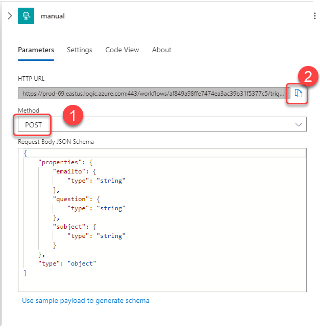

# AUTOMATE YOUR MAILBOX RESPONSES

## Objective

In this lab you will lean how to use OpenAI to help answer common IT questions sent to help desk mailboxes.

 

## Summary

You will deploy two Logic Apps. They will be deployed together.

Logic App 1 (read-mailbox-techsupport): reads incoming email from an Outlook mailbox and calls Logic App 2.

Logic App 2 (email-techsupport-integration): Calls Azure OpenAI for answers to the user support question and emails back a response.

## Step 1. Sign in to Azure Portal

> [!IMPORTANT]
> Use Edge or Chrome browser when making changes to the Logic Apps to prevent authorization issues when setting the **Connections** steps to your Microsoft 365 hosted mailbox.

Go to <https://portal.azure.com> and enter your credentials

## Step 2. Deploy Logic Apps

### OpenAI Prompt Overview

This logic app uses the following prompt to answer questions sent to a technical support mail box:

---

You are a Helpdesk assistant. Extract the person's name and technical problem from the text below. Provide possible solutions including links to websites in html. If no solutions are found, respond with 'We will get back to you in 48 hrs'.
If this is a hardware problem give them tips for troubleshooting and indicate we will create a support ticket and schedule a repair within 48 hours.

---

In this step you are going to perform the following actions to deploy and configure the Logic App:

1. Deploy the Logic App that sends the user question to OpenAI.
1. Authorize the connection to your Office 365 mailbox.
1. Enable the Logic App that reads your mailbox.

After the deployment you should see four new items in your resource group:

1. Click on the `office365` API Connection and click the **Edit API connection** menu

1. Click **Authorize**. In the authentication dialog, sign in with your Office 365 account that has mailbox access.

    

1. Click **Save**.

1. Return to the Resource Group overview and click on the `read-mailbox-techsupport` Logic App.

1. Click `Enable`.

    

### Step 3. Test

Send an email, as follows, to the mailbox configured in your second logic app

---
**Email Subject:**
Helpdesk bot

**Email body:**
Hello,

I can't login into my account, I need to reset my password. Also my keyboard is not working.

Thank you

Your Name

---

Monitor your inbox for the automated email response. As soon as you receive it, open the email and **click one of the options provided**:

