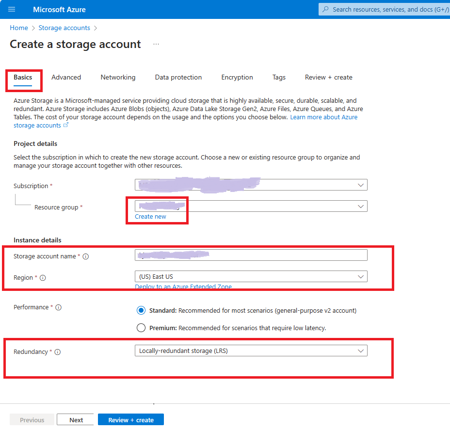
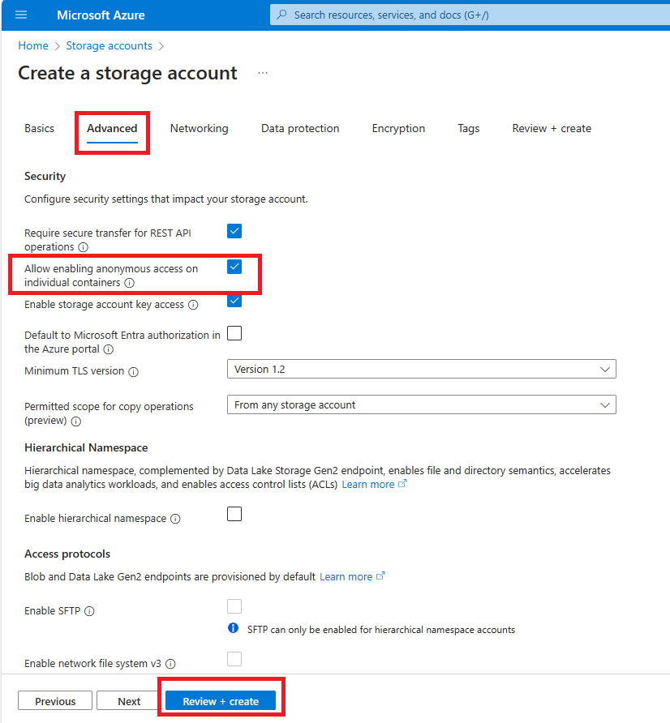
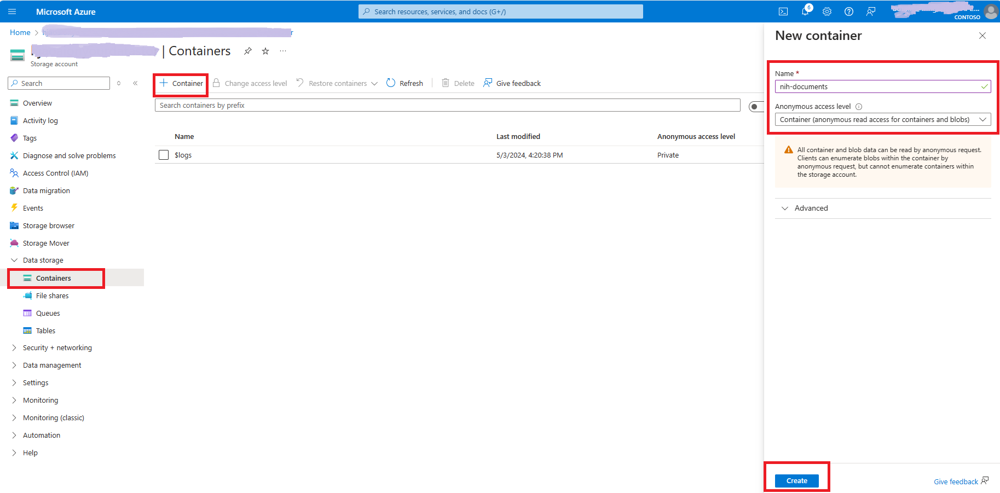
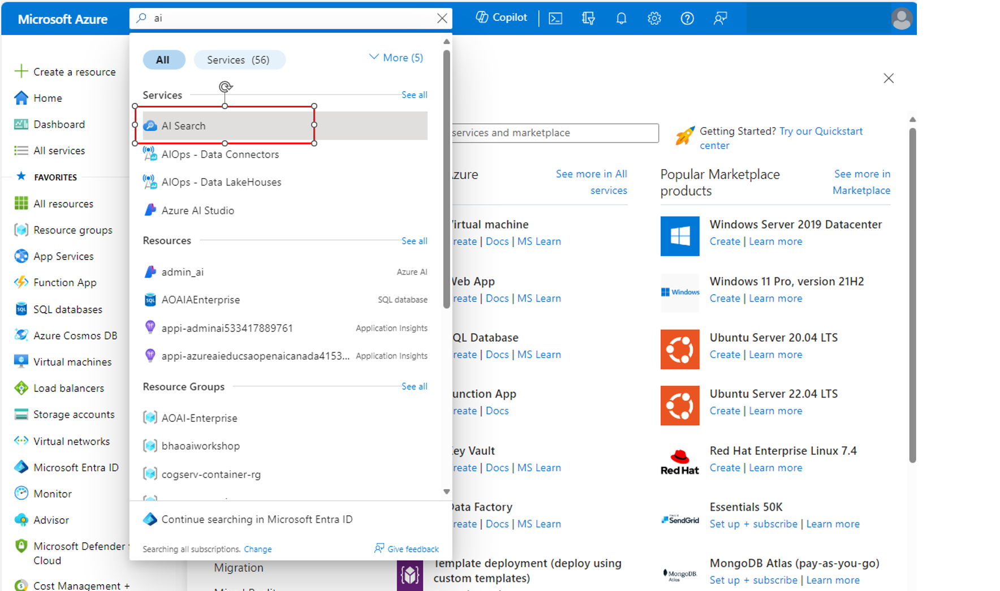
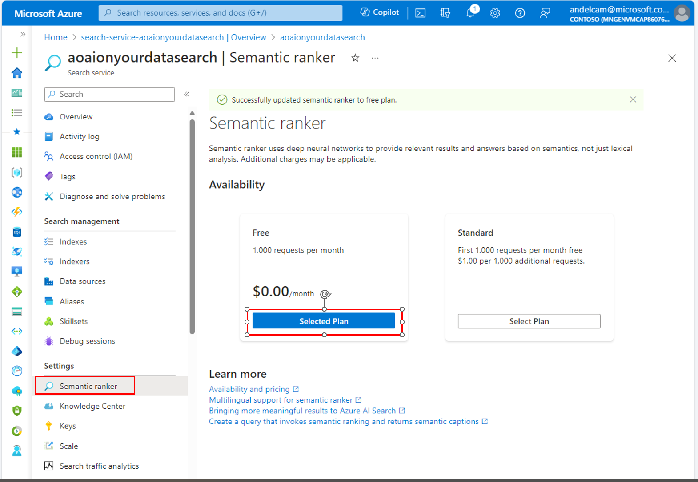
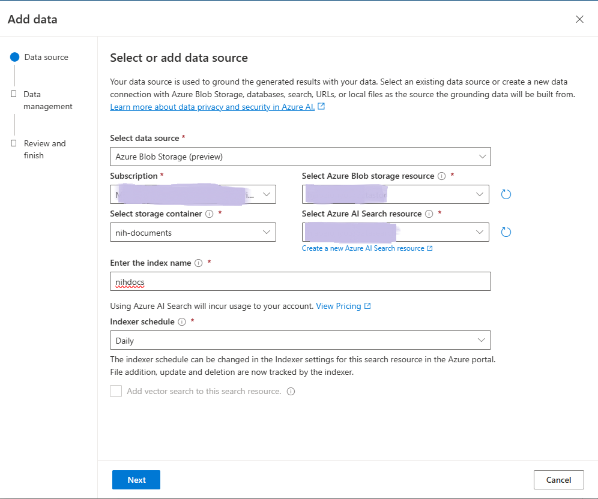
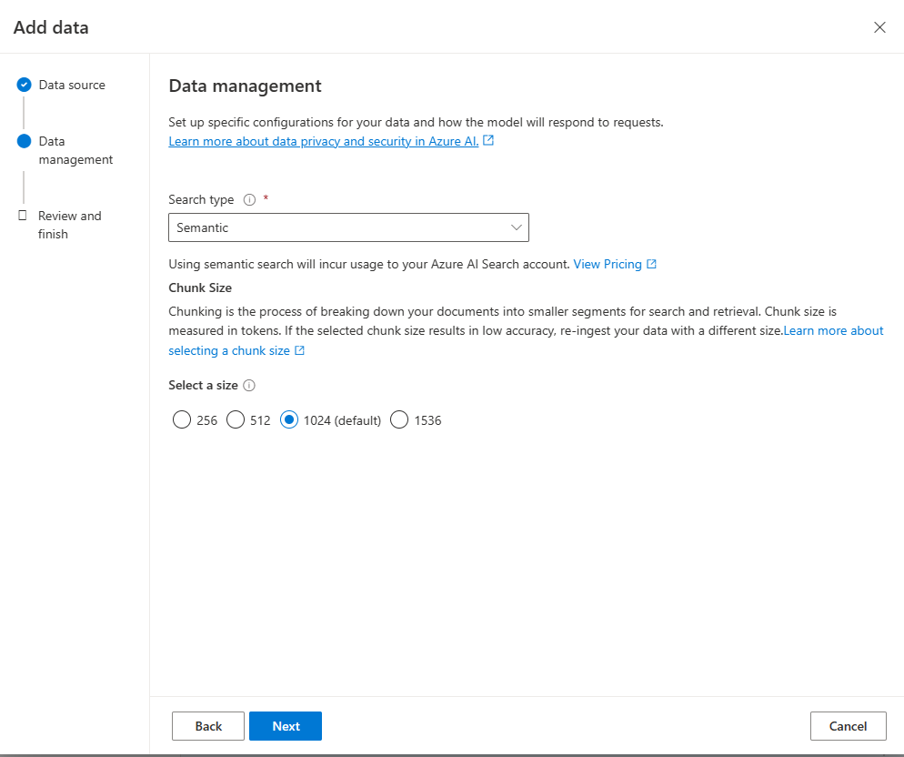
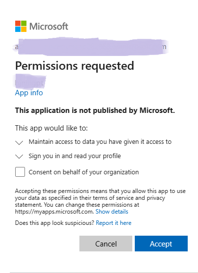

# Azure OpenAI On Your Data Workshop

In this workshop, you will learn how to use Azure OpenAI On Your Data to chat with the NIH’s 321 page PDF for preparing and submitting grant applications to Grants.gov. You will be able to ask questions and get answers from the guidelines using natural language, as well as analyze and summarize the content using powerful language models such as GPT-35-Turbo and GPT-4.


1. [Create Storage Account Resource](#create-storage-account-resource)
1. [Create a Cognitive Search Resource](#create-a-cognitive-search-resource)
1. [Deploy a GPT-35-turbo-16k model](#deploy-a-gpt-35-turbo-16k-model)
1. [Set the System Message](#set-the-system-message)
1. [Add your data](#add-your-data)
1. [Deploy to Web App](#deploy-to-web-app)


## Create Storage Account Resource
To chat with and analyze your own data, you need to create a storage account in Azure to host the data. A storage account is where you store and manage your data source, such as a PDF document, a web page, or a database

1. From the Azure Portal, search for *Storage* in the **Global Search Bar** and select **Storage Accounts**. Next, click **+ Create** a the top of the Storage Accounts section.

    

1. Select your Azure OpenAI **Subscription** and create a new *Resource Group* called *AOAI-OnYourData-RG* by clicking the **Create new** link under the Resource Group dropdown and clicking **OK**
    
    

1. Provide a *globally unique* **Storage Account name**, choose *East US* as your **Region**, and select *Locally Redundant Storage* for **Redundancy**. Next, click **Review** and finally **Create**.

    

1. Once the resoruce is created click the **Go To Resource** button. From your storage account's page, select **Containers** from the left-hand navigation pane and create a new container called *nih-documents*

    

1. Click on your new **nih-documents** container and upload the [NIH grant writing manual](data/general-forms-h.pdf).

    

## Create a Cognitive Search Resource
A Cognitive Search service in Azure is another requirement for models to chat with and analyze your own data. A Cognitive Search service is where you index and enrich your data source, such as a PDF document, a web page, or a database. A Cognitive Search service also provides retrieval and augmentation benefits, such as natural language processing, semantic ranking, and faceted navigation.

1. From the Azure Portal, search for *Search* in the **Global Search Bar** and select **Cognitive Search**. Next, click **+ Create** at the top of the Cognitive Search section.

    

1. Select your Azure OpenAI **Subscription** and the *AOAI-OnYourData-RG* **Resource Group**. Choose a globally unique **Service Name**, *East US* for the region, and leave **Pricing tier** as *Standard.* Click **Review + Create** and finally **Create**.

    

1. Once the resoruce is created click the **Go To Resource** button. From your Cognitive Search resource page, select **Semantic search** from the left-hand navigation blade and enable the *Free* tier. 

    

## Deploy a GPT-35-turbo-16k model

*If you have already deployed a GPT-35-turbo-16k model, you can skip this step and use your existing deployment.*

Models, such as GPT-3 or GPT-4, must be deployed for you to use them. When you deploy a model in Azure OpenAI, you create an instance of the model that you can use and access through a REST API or the web-based interface in the Azure OpenAI Studio. This allows you to chat with and analyze your own data using the model’s capabilities. You can also fine-tune and prompt the model for specific tasks and scenarios by deploying a model.

1. Choose **Models** from the left-hand navigation pane of the *Azure AI Studio*, then select **gpt-35-turbo-16k** and click **Deploy.**

    

1. Give your deployment a meangingful name, expand **Advanced Options** and ensure your token limits are set to the maximum value. Next, click **Create**.

    

## Set the System Message

A system message is a type of prompt that can be used to guide the behavior and performance of a chat model in Azure OpenAI On Your Data. A system message can define the model’s profile, capabilities, limitations, output format, examples, and guardrails for a specific scenario. A system message can help increase the accuracy and grounding of the model’s responses based on the user’s data.

1. Copy the following system prompt into your clipboard:
```
Your name is GrantGPT, a friendly and helpful grant-writing assistant tasked with helping a principal investigator (PI) write grant research grant proposals, receive feedback on their proposals, and answer questions on the NIH's grant writing guidelines. You have been grounded on the NIH's grant writing guidelines and that is the only source of data you are allowed to use to answer questions. If there isn't enough information, say you do not know. If asking clarifying questions to the user would help, ask the question.
```
1. From the *Azure AI Studio* click **Chat** from the left-hand navigation pane and paste the contents of your clipboard into the **System message** text box. Next, click **Save changes.**

    

1. After your System Message has been saved, test the chatbot by asking it how it can help you.

    

## Add your data
1. From the *Chat* section of *Azure AI Studio* click **Add your data** followed by **+ Add a data source**.

    

1. Select *Azure Blob Storage* for **Select data Source**. Set **Subscription** to your Azure OpenAI subscription, **Azure Blob Storage resource** to the storage account created previously, **Storage container** to the container we uploaded the documents to. 

1. Next, set **Azure Cognitive Search resource** to the Cognitive Search resource created previously, set the **index name** field to *nihdocs* and **Index schedule** to daily. Leave the vector search option off and check the checkbox that warns about usage charges and click **Next**.

    

1. Chose *Semantic* for **Search Type**, check the box that warns against usage charges and click **Next**. Finally, click **Save and Close.**
    
    

Your data will take a few minutes to processed into "*chunks*." This is done because Azure OpenAI models can only process a limited amount of text at a time. To use them on large data sources, you need to split your data into smaller chunks. Azure Cognitive Search uses a custom skill that leverages the Azure OpenAI chunking API to first chunk the data in the storage account and then index the the chunks.


Once the system is done processing the data, you can interact with the chat session to test it.


 


## Deploy to Web App

Now that that we've confirmed that GPT is grounded on your data, we can deploy this as a dedicated web app.

1. Click on the **Deploy To** button on the top-right of the screen and select *A new web app...*

    

1. Select *Create a new web app*, provide it with a globally-unique **Name**. Choose your OpenAI **Subscription** and the *AOAI-OnYourData-RG* for the **Resource Group**. Next, select your preferred **Region** and *S1* for the **Pricing Plan**. Finally, click **Enable Chat History** and acknowledge that both Chat History and the Web App will incur charges. Finally, click **Deploy**.

    

  
The deployment will take a few minutes to complete. After it is done, there'll be an additional wait of approximiately 10 minutes for Entra ID to secure the web app. Once it is complete, you'll be able to click the **Launch Web App** icon on the top right of the screen to take you to your new chat bot.  





---

**Warning:** The resources deployed in this lab are not free and will incur charges if you do not delete them after completing the lab. To avoid unwanted charges, please follow the instructions in the [cleanup section](cleanup.md) to delete the resources when you are done.

--- 
